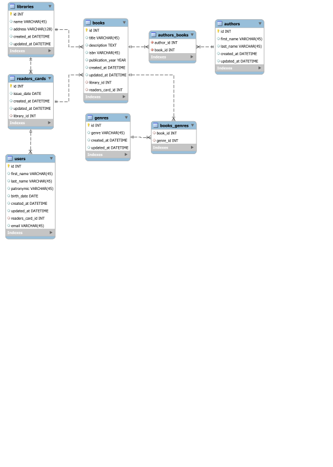

# Владислав Магденко КС33
Веб-застосунок «Бібліотека» написаний на мові Ruby. Застосунок містить шість таблиць, які забезпечують його ефективне функціонування.
Таблиця «Бібліотеки», яка містить інформацію про кожну бібліотеку. Таблиця «Книги», в якій зберігаються дані про книги, наявні в кожній бібліотеці. Кожна книга пов’язана з бібліотекою та може мати кількох авторів і жанрів.
Таблиця «Автори», яка містить інформацію про кожного автора. 
Таблиця «Жанр», у якій зберігається інформація про різні жанри книг, доступних у кожній бібліотеці. 
Таблиця «Картка читача», в якій зберігається інформація про зареєстрованих учасників бібліотеки. 
Таблиця «Користувачі», в якій зберігається інформація про осіб, яким видано читацький квиток. 

## HTTP Verbs
| HTTP METHOD | URL             | Payload | Description                  |
|-------------|-----------------|---------|------------------------------|

## ERD diagram

### Labs

- [ ] Task 1 -> Rails додаток Бібліотеки. Такі таблиці:   
  Бібліотеки (поля на вибір)   
  Книги (поля на вибір. Бібліотека може мати n книг)  
  Автори (поля на вибір. Книга може мати n авторів)  
  Жанр (поля на вибір. Книга може мати n авторів)  
  Карта Читача (поля на вибір. Бібліотека може мати n карт)  
  Користувачі (поля на вибір У карті може бути 1 користувач).  
- [ ] Task 2 --> Вставити 100 записів у ваші таблиці. У кожній групі по 6 таблиць в 3 таблиці зробити методи, які будуть обгорткою на чистому SQL. У 3 таблиці просто на ОРМ.
  У кожній моделі повинні бути методи на оновлення. В 3 таблиці зробити методи, які будуть обгорткою на чистому SQL. У 3 таблиці просто на ОРМ.
  Зробити по 2 SQL VIEW.
- [ ] Task 3 --> Зробити CRUD форми под кожну модель та тести
- [ ] Task 4 --> Додати гем Devise до вашого веб застосунку (повинна бути можливість зареєструватись/залогінитись/востановити пароль)  
                 Додати тести  
                 Додати CSS/JS   
- [ ] Task 5 --> Зробити root_page (наповнення яке завгодно але повинне бути посилання на вхід/реєстрацію)  
                 Пропрацювати інформацію про лікарні, бібліотеки (треба додати назву, рік створення)  
                 Створити таблиці як на зображенні  
                 Створити сторінки під кожну модель  
                 Додати логіку під Пошук та Сортування ----- Створити це за допомогою QueryObject  
                 Додати тести під кожний елемент  
- [ ] Task 6 --> Зробити rake задачу котра буде парсити сайт 
                 1 https://www.hospitalsafetygrade.org/all-hospitals ------> Якщо у вас лб про лікарні
                 2 https://en.wikipedia.org/wiki/List_of_libraries ------> Якщо у вас лб про бібліотеки
                 Використовувати гем https://github.com/sparklemotion/nokogiri
                 Та додавати у вашу БД назву лікарні або бібліотеки
- [ ] Task 7 --> В залежності від того с чим ви працюєте 
                 1) продивитись файл
                 2) додати поля (Street Address,City,Zip Code) до бібліотек та (type, city, RatingMortality) у лікарні
                 3) додати файл до додатка (наразі просто у папку його покладіть)
                 4) розпарсить файл та зберігти дані за допомогою rake задачі
- [ ] Task 8 --> Додати можливість завантажувати 2 файла (СSV, PDF)
                 Вимоги -- 
                 СSV --- в одному файлі всі ваши бібліотеки або ліукарні та читачи/хворі які є в лікарні або бібліотеки (це повинно бути в одному файлі)
                 PDF (може бути декілька файлів )--- 
                       інформація про  всі ваши бібліотеки або ліукарні та читачи/хворі які є в лікарні або бібліотеки (це повинно бути в одному файлі)
                       інформація про кожну окрему бібліотеку (додаті кольори та зображення)
                        інформація про кожного користовача  (додаті кольори)
                 додати тести